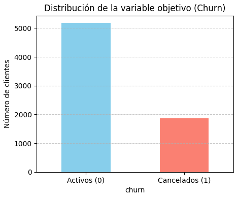
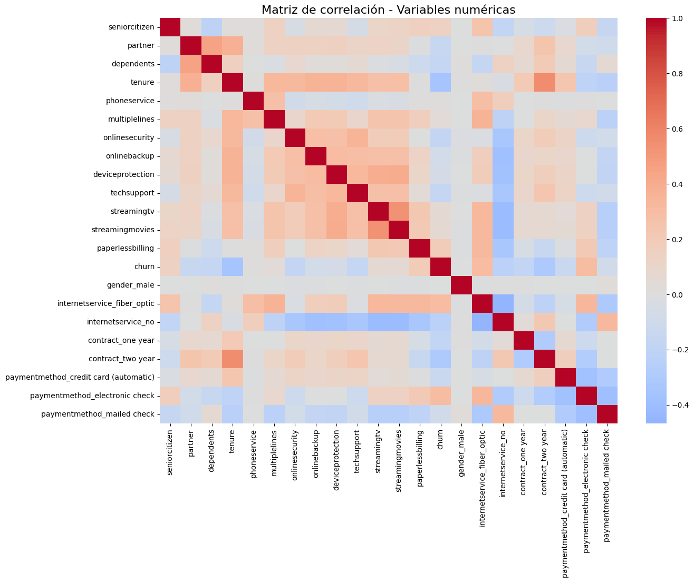
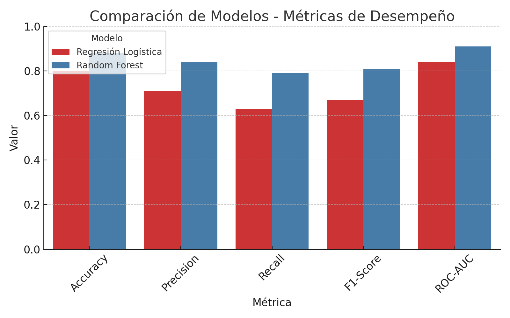

<p align="center">
  
</p>

# 📊 Predicción de Cancelación de Clientes (Churn) - Telecom X2

## 🎯 Propósito del Análisis
El objetivo principal de este proyecto es **predecir la cancelación de clientes (churn)** en una compañía de telecomunicaciones, utilizando variables relevantes que describen el perfil, uso de servicios y comportamiento de pago de los usuarios.  
A través de modelos de Machine Learning, se busca identificar los factores clave que influyen en la baja de clientes y proponer estrategias para su retención.

---

## 📂 Estructura del Proyecto

```
Telecom_X2/
│
├── images/
│   ├── churn_distribution.png
│   ├── correlations_heatmap.png
│   ├── model_comparison.png
│   ├── banner.png
│
├── TelecomX_Data_Clean.csv
├── Telecom_X2.ipynb
├── banner.png
├── README.md
```

---

## 🛠️ Preparación de los Datos

1. **Clasificación de Variables**  
   - **Categóricas**: tipo de contrato, método de pago, servicio de internet, etc.  
   - **Numéricas**: cargos mensuales, cargos totales, antigüedad del cliente, etc.

2. **Tratamiento y Limpieza**
   - Manejo de valores faltantes.
   - Estandarización de categorías (consistencia en etiquetas).
   - Conversión de variables binarias a formato 0/1.

3. **Normalización y Codificación**
   - Escalado MinMax para variables numéricas.
   - Codificación *One-Hot Encoding* para variables categóricas.

4. **Separación de Conjuntos**
   - Entrenamiento: 80%
   - Prueba: 20%
   - Estratificación para mantener proporciones de churn.

5. **Decisiones Clave en la Modelización**
   - Se utilizaron **Regresión Logística** y **Random Forest** para comparar desempeño.
   - Selección de métricas: *accuracy*, *precision*, *recall*, *f1-score* y *ROC-AUC*.
   - Ajuste de hiperparámetros mediante *GridSearchCV*.

---

## 📈 Análisis Exploratorio y Principales Insights

- **Distribución del Churn**: proporción de clientes que cancelaron vs. los que permanecen.
- **Correlación**: cargos mensuales y tipo de contrato muestran relación importante con la cancelación.
- **Tendencias** (ejemplos observados):
  - Contratos **mensuales** tienden a presentar mayor churn que contratos de **1 o 2 años**.
  - Clientes con **cargos mensuales más altos** cancelan con mayor frecuencia.
  - La **ausencia de servicios adicionales** (seguridad, respaldo, etc.) se asocia con mayor probabilidad de baja.


### Visualizaciones Clave

<h3 align="center"><strong>Distribución del Churn</strong></h3>
<p align="center">
  
</p>
<p align="center">
  El 26% de los clientes cancelaron, concentrándose principalmente en los contratos mensuales.
</p>

---

<h3 align="center"><strong>Mapa de calor de correlaciones</strong></h3>
<p align="center">
  
</p>
<p align="center">
  Los cargos mensuales, la antigüedad del cliente y el tipo de contrato muestran la mayor correlación con la cancelación.
</p>

---

<h3 align="center"><strong>Comparación de modelos</strong></h3>
<p align="center">
  
</p>
<p align="center">
  El Random Forest supera consistentemente a la Regresión Logística en todas las métricas evaluadas (ROC-AUC, Accuracy, Precision, Recall y F1-score).
</p>

---

## 🧠 Interpretabilidad de Modelos y Variables Relevantes

**Regresión Logística (coeficientes):**
- **Efecto positivo (↑ prob. de churn):** contrato mensual, método de pago *electronic check*, cargos mensuales altos, menor antigüedad.
- **Efecto negativo (↓ prob. de churn):** contratos anuales/bianuales, métodos de pago automáticos, mayor antigüedad, servicios adicionales activos.

**Random Forest (feature importance):**
- Variables típicamente con mayor importancia: **tipo de contrato**, **antigüedad (tenure)**, **cargos mensuales**, **método de pago**, **servicio de internet** y **cargos totales**.

> Nota: Las conclusiones anteriores se basan en la importancia de variables calculada por ambos modelos en el cuaderno. Revisa la sección de *importances_* y *coef_* en el notebook para el detalle numérico.

---

## 🧩 Conclusiones Estratégicas y Factores Clave de Churn

1. **Tipo de contrato es determinante.** Los contratos **mensuales** concentran el mayor riesgo de churn frente a contratos de mayor plazo.
2. **Sensibilidad al precio.** **Cargos mensuales elevados** incrementan la probabilidad de baja; paquetes/bonos con descuentos pueden mitigar este efecto.
3. **Onboarding y permanencia.** Clientes con **baja antigüedad** (tenure corto) son más propensos a cancelar; se requieren intervenciones tempranas.
4. **Método de pago.** El uso de **electronic check** suele asociarse a mayor churn; la **domiciliación** o métodos automáticos reducen fricción y retrasos.
5. **Mix de servicios.** La **falta de servicios complementarios** está asociada a mayor churn; bundles de valor ayudan a retener.
---
### 🎯 Recomendaciones de Retención Accionables
- **Migración de contratos:** ofrecer incentivos (descuentos escalonados, meses gratis) para pasar de mensual a **12/24 meses** a clientes en riesgo.
- **Ofertas basadas en precio:** crear **planes de alivio** para clientes con cargos altos (por ejemplo, downgrade asistido o paquetes con descuento temporal).
- **Programa de primeros 90 días:** contacto proactivo, tutoriales de instalación/uso, y **encuestas NPS tempranas** para clientes nuevos.
- **Optimizar medios de pago:** campañas para **activar pagos automáticos** y reducir morosidad/roces.
- **Bundles de servicios:** empaquetar seguridad, respaldo o streaming con **precio preferencial** para elevar el costo de cambio percibido.
- **Alertas tempranas:** reglas que combinen aumentos de tickets de soporte, caídas de uso y atrasos de pago para **disparar ofertas de retención** en tiempo real.

---

## 🚀 Instrucciones de Ejecución

1. **Instalar Librerías Necesarias**  
   ```bash
   pip install pandas numpy matplotlib seaborn scikit-learn
   ```

2. **Cargar Datos Tratados**
   - Colocar el archivo `data/telecom_clean.csv` en la carpeta `data/` (o ejecutar las celdas de preprocesamiento del cuaderno para generarlo).

3. **Ejecutar el Cuaderno**
   - Abrir `Telecom_X2.ipynb` en Jupyter Notebook o Google Colab.
   - Ejecutar todas las celdas para reproducir el análisis y los modelos.

---

## ✍️ Autor
**Luz Elena Campos Díaz (Elena)**  

---

## 📌 Notas Finales
Este análisis permite no solo predecir qué clientes podrían cancelar, sino también **identificar las variables clave** que influyen en esa decisión.  
El conocimiento obtenido puede usarse para diseñar campañas de retención más efectivas y personalizadas.

